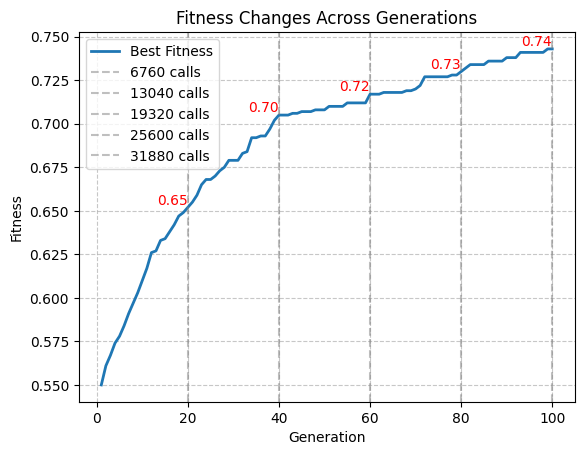
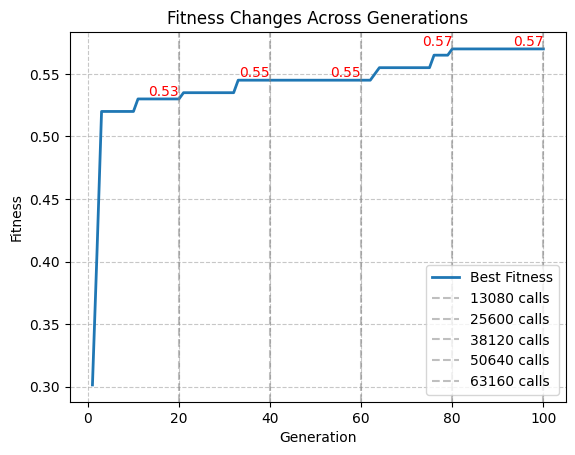
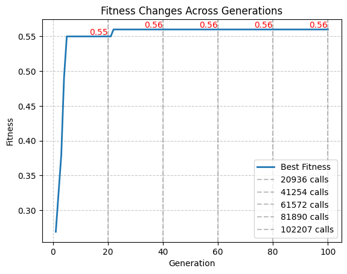

# Report on the Genetic Algorithm Implementation

## Overview
The provided code implements a Genetic Algorithm (GA) to solve an optimization problem. The algorithm involves evolving a population of individuals over multiple generations, applying crossover and mutation operations to create new individuals, and selecting the best individuals based on a fitness function.

## Genetic Algorithm Class
The `GeneticAlgorithm` class is the core of the implementation. It is initialized with parameters such as the number of populations, population size, genome length, crossover rate, mutation rate, and the fitness function. Key methods and attributes include:

**The algorithm is designed to minimize the number of fitness calls, but how much is too much?**

 For this lab i tried to aim for about 100k calls as a ceiling for problem instance = 10 for the 100th generation, that is the most "expensive" one.

- `initialize_population`: Creates initial populations for each island using random binary strings of 0s and 1s.
- `custom_crossover`: Performs a custom crossover between two individuals, allowing the exchange of genetic material in segments.
- `mutate`: Introduces mutations in an individual by randomly flipping bits in segments.
- `evaluate_population`: Computes the fitness values for all individuals in the population.
- `run`: Executes the GA for a specified number of generations, evolving the population and updating the best individual and fitness along the way.
- `plot_fitness_history`: Plots the change in best fitness values across generations.

## Custom Crossover and Mutation
The implementation features a custom crossover method (`custom_crossover`) that iteratively performs crossover operations on segments of individuals. Additionally, a mutation method (`mutate`) selectively mutates segments of an individual based on a mutation rate. This is done because I found that a mutation of one single locus out of 1000 is not enough to introduce diversity.

## Main Loop
The algorithm is kickstarted with the `island method` and then runs for a predefined number of generations, maintaining `elitism` for each generation. In each generation, the best individuals are selected, and custom crossover and mutation operations are applied to create offspring. The offspring , that is initially a set to avoid inserting children duplicates, are then converted to list and added to the population, the population is evaluated and sorted based on fitness, retaining the top individuals.

## Parameter Tuning
The code provides an example of running the GA for multiple problem instances defined by the parameter `a`. Each problem instance is associated with a specific fitness function created using the `lab9_lib.make_problem` function.

## Plotting
The algorithm includes a method (`plot_fitness_history`) for visualizing the change in best fitness values across generations. The plot displays individual vertical lines at specified markers and corresponding fitness values.

## Execution
The GA is executed for each problem instance given by the lab specification, and the best individual, best fitness, and total fitness calls are printed for each instance [1,2,5,10].

## Results 
- ### Problem 1

- ### Problem 2

- ### Problem 5

- ### Problem 10

## Comments

- The algorithm always perform equal or better in the problem instance = 2 rather than = 1, most likely due to the mutate method.

- The choice of parameters such as crossover rate, mutation rate, and the number of populations may significantly impact algorithm performance, the ones I used are the result of a lot of trial and error.Experimenting with different parameter values could leave to better (or worse) results.

- The implementation is generalized to accommodate different types of problems by allowing users to define their custom fitness functions, so long the problem involves binary genomes.

Overall, the code provides (hopefully) a decent try for solving the optimization problems using a Genetic Algorithm.

## Collaborations / Sources

For this laboratory I worked alone since most of my close friends dropped the course... but in general I sticked exploiting the basic python documentation to implement the GA class and matplot method, it seems that most of the other collegues used it to provide a nice graph to show the results instead of the ugly console log that I used in the previous labs.
